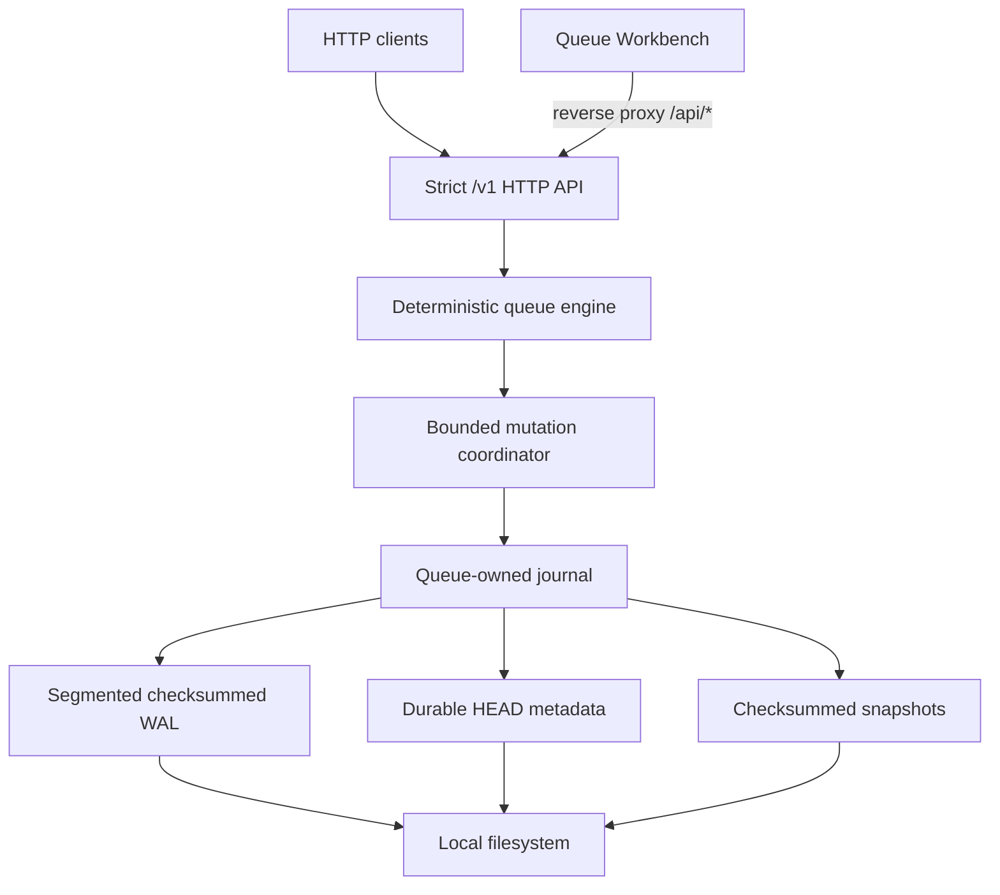
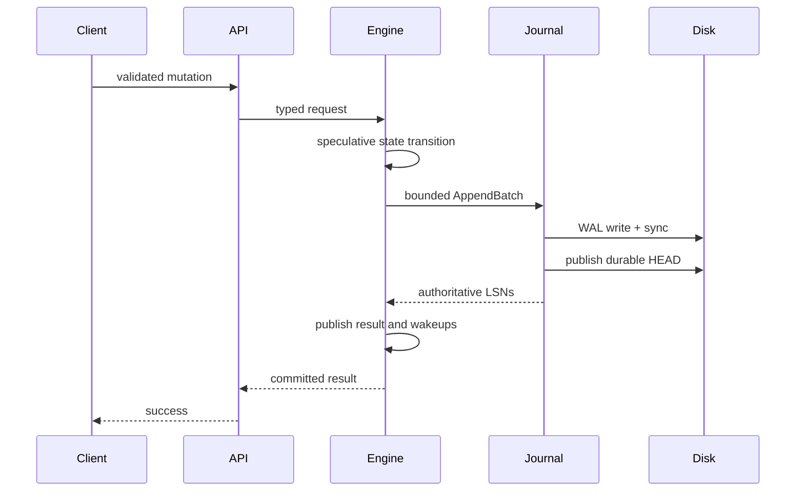
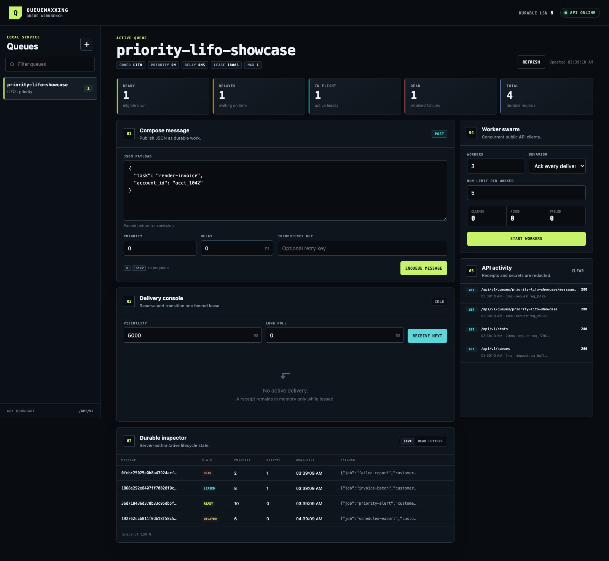

# Queuemaxxing

A durable concurrent HTTP job queue with composable FIFO/LIFO ordering, signed priority, delayed delivery, visibility leases, dead letters, idempotent mutations, and queue-owned persistence.

[Public repository](https://github.com/ElijahUmana/queuemaxxing) · [OpenAPI contract](docs/openapi.yaml) · [Architecture reference](docs/architecture.md)

## Contents

- [What it delivers](#what-it-delivers)
- [Ordering semantics](#ordering-semantics)
- [Architecture](#architecture)
- [Durability and recovery](#durability-and-recovery)
- [Delivery, retries, and replay](#delivery-retries-and-replay)
- [Queue Workbench](#queue-workbench)
- [Quickstart](#quickstart)
- [HTTP workflow](#http-workflow)
- [Verification evidence](#verification-evidence)
- [Assessment questions](#assessment-questions)

## What it delivers

| Requirement | Implementation |
| --- | --- |
| FIFO or LIFO | Immutable per-queue ordering policy |
| Optional priority | Signed 32-bit priority; larger values are selected first |
| Initial delay | Relative `delay_ms` or absolute `available_at`; delayed messages are ineligible until server time reaches the deadline |
| Composed policies | FIFO, LIFO, priority FIFO, and priority LIFO, each with immediate or delayed messages |
| Durable persistence | Segmented write-ahead log, durable HEAD metadata, checksummed snapshots, compaction, and deterministic recovery |
| Queue-owned storage | No database, Redis deployment, or external broker |
| Concurrent producers/consumers | Bounded mutation coordinator, durable group commit, lease fencing, race-tested engine and journal paths |
| At-least-once delivery | Durable visibility leases, ack, nack, extension, lease expiry, maximum deliveries, dead letters, and redrive |
| Real application | Separate browser Workbench using only the public HTTP API |
| Language-neutral access | Versioned strict JSON API plus a typed Go client |

Additional production-facing behavior includes opaque snapshot-consistent pagination, durable idempotency records, admission control, graceful draining, loopback-by-default exposure, fail-stop storage handling, nonroot containers, and owner-only storage permissions on Unix-permission platforms.

## Ordering semantics

Eligibility is evaluated before ordering:

```text
eligible(message, now) =
  message is ready
  AND available_at <= now
  AND no active visibility lease
```

Selection among eligible messages is deterministic:

| Queue policy | Selection key |
| --- | --- |
| FIFO | `sequence ASC` |
| LIFO | `sequence DESC` |
| Priority FIFO | `priority DESC, sequence ASC` |
| Priority LIFO | `priority DESC, sequence DESC` |

Delay is an eligibility gate, not an ordering key. A delayed high-priority message cannot displace an eligible message until its availability deadline. Nack and lease expiry preserve message ID, sequence, and priority, so retries do not silently become new enqueues. Concurrent consumers are guaranteed reservation order, not response or worker-completion order.

## Architecture



The boundaries are deliberate:

- `api` owns strict HTTP parsing, request limits, admission, deadlines, problem responses, and graceful draining.
- `internal/engine` owns ordering, leases, retries, idempotency, pagination, capacity accounting, and the serialized state machine.
- `internal/journal` owns framing, contiguous LSNs, synchronization, segment rotation, snapshots, compaction, locking, quarantine, and recovery.
- `client` and the Workbench consume the same public API; neither bypasses it to call engine or storage internals.

A normal mutation crosses one durability protocol:



The engine admits at most 256 queued mutations, groups at most 64 state-changing records or 8 MiB, and uses a 250 µs collection window. Invalid neighbors fail independently. A storage failure rolls back the entire successful speculative prefix before any result is published.

## Durability and recovery

The storage layer is part of the queue, not delegated infrastructure.

- Binary WAL frames are versioned, length-bounded, and checksummed.
- Each store has a persistent identity, contiguous LSN order, segment IDs, and a previous-segment digest chain.
- The 72-byte HEAD file records the WAL floor/head, durable LSN, snapshot generation, and snapshot through-LSN.
- Snapshots are checksummed complete-state images; compaction retains a valid fallback until new state is durable.
- Successful mutations are not returned before WAL synchronization and durable HEAD publication.
- A write, flush, sync, rotation, or checkpoint failure puts storage into fail-stop read-only mode rather than claiming uncertain durability.
- An exclusive process lock prevents two writers from opening one data directory.
- Rooted filesystem operations reject symlinked managed directories and non-regular WAL/snapshot entries.

Startup validates store identity, HEAD invariants, segment and LSN continuity, digest chaining, snapshot compatibility, persisted queue/message constraints, receipt uniqueness, idempotency result shapes, and runtime capacity limits.

Only a structurally incomplete final frame at the newest writable tail may be repaired. Complete checksum corruption, older-segment corruption, missing durable data, LSN gaps, or invalid persisted state stops startup. Torn-tail bytes and invalid snapshots are quarantined as evidence instead of being silently discarded.

## Delivery, retries, and replay

The queue provides **at-least-once delivery**.

```text
enqueue -> delayed or ready -> leased
                              |-- ack ----> acknowledged
                              |-- nack ---> ready, delayed, or dead
                              `-- expiry -> ready or dead

dead letter -- redrive --> new child message
```

A receive increments `delivery_count` and `lease_epoch`, persists the reservation, and returns an opaque high-entropy receipt. A receipt is valid only while `server_now < lease_until`. At exact expiry it is stale. Every later reservation permanently fences every older receipt, preventing an old worker from acknowledging a newer worker's lease.

`max_deliveries = N` permits at most N reservations. A timely ack of delivery N succeeds; nack or expiry of delivery N creates a retained dead letter. Redrive creates a new ID and sequence, resets delivery count, retains the source for audit, and records `replay_of`.

“Replay” is handled according to its source:

1. **Visibility-timeout redelivery:** the same message returns to eligibility with its identity and ordering sequence preserved.
2. **Producer or control-request replay:** a durable idempotency record binds operation, queue, key, canonical request fingerprint, committed response, expiry, and committed LSN. Same key plus same request returns the committed result; a different request returns `idempotency_conflict`.
3. **Receive replay:** an idempotent receive returns the same committed delivery, receipt, and deadline rather than creating another reservation.
4. **Acknowledged-receipt replay:** retained receipt tombstones make a repeated ack return the prior terminal outcome.
5. **Dead-letter redrive:** an idempotent redrive creates exactly one child and links it to the source.
6. **Storage replay:** startup loads the selected snapshot and replays every later contiguous committed WAL transaction.

Consumers still make downstream side effects idempotent because a worker may finish external work and crash before its ack is durable.

## Queue Workbench



The Workbench is a separate Go process with embedded HTML, CSS, and JavaScript. It supports:

- Queue creation and FIFO/LIFO/priority policy inspection
- Immediate and delayed enqueue
- Receive, ack, nack, and lease extension
- Dead-letter inspection and redrive
- Concurrent worker swarms
- Queue and storage statistics
- Lease countdowns and restart/read-after-restart demonstrations

Payloads are rendered through DOM APIs and `textContent`, never injected as HTML. The process sends CSP and browser security headers, aborts stale requests, fences refresh generations, validates request IDs, and logs bounded route categories rather than raw queue/message paths or upstream error strings.

The screenshot above was captured from binaries built at implementation SHA `a6bcab5397b5c96cb436b621486c8dac5d0aa367` with a 1600×1100 Chromium viewport. The queue is priority LIFO and contains one ready, one delayed, one in-flight, and one dead-letter message. The evidence manifest recorded zero console errors.

## Quickstart

Prerequisites: Docker with Compose, or the Go version declared in `go.mod`.

```bash
git clone https://github.com/ElijahUmana/queuemaxxing.git
cd queuemaxxing
docker compose up --build
```

- Queue API: `http://127.0.0.1:8080`
- Queue Workbench: `http://127.0.0.1:8081`
- Persistent named volume: `queue-data`

Compose runs both services with a read-only root filesystem, nonroot distroless runtime, `no-new-privileges`, loopback-only host publication, and a persistent `/data` volume. The services explicitly bind non-loopback only inside the container network so the Workbench can reach the queue.

Native build and startup:

```bash
make verify
make build
./bin/qmax serve --listen 127.0.0.1:8080 --data-dir ./qmax-data
./bin/qmax-workbench --listen 127.0.0.1:8081 --api-url http://127.0.0.1:8080
```

Both binaries reject non-loopback listen addresses unless the operator supplies the explicit opt-in. That opt-in changes reachability; it does not add authentication or TLS.

## HTTP workflow

Create a priority LIFO queue:

```bash
curl --fail --silent --show-error \
  -X POST http://127.0.0.1:8080/v1/queues \
  -H 'Content-Type: application/json' \
  -H 'Idempotency-Key: create-critical' \
  -d '{
    "name": "critical",
    "ordering": "lifo",
    "priority_enabled": true,
    "default_visibility_timeout_ms": 30000,
    "max_deliveries": 3
  }'
```

Enqueue delayed priority work:

```bash
curl --fail --silent --show-error \
  -X POST http://127.0.0.1:8080/v1/queues/critical/messages \
  -H 'Content-Type: application/json' \
  -H 'Idempotency-Key: enqueue-order-42' \
  -d '{
    "payload": {"order_id": 42, "task": "capture"},
    "priority": 50,
    "delay_ms": 250
  }'
```

Receive and acknowledge one message with `jq`:

```bash
DELIVERY=$(curl --fail --silent --show-error \
  -X POST http://127.0.0.1:8080/v1/queues/critical/messages:receive \
  -H 'Content-Type: application/json' \
  -H 'Idempotency-Key: receive-worker-1-1' \
  -d '{"visibility_timeout_ms":30000,"wait_timeout_ms":5000}')

MESSAGE_ID=$(printf '%s' "$DELIVERY" | jq -r '.messages[0].message.id')
RECEIPT=$(printf '%s' "$DELIVERY" | jq -r '.messages[0].receipt_handle')

curl --fail --silent --show-error \
  -X POST "http://127.0.0.1:8080/v1/queues/critical/messages/$MESSAGE_ID/ack" \
  -H 'Content-Type: application/json' \
  -H 'Idempotency-Key: ack-worker-1-1' \
  -d "{\"receipt_handle\":\"$RECEIPT\"}"
```

The full route, schema, limit, content-type, and response matrix is in [`docs/openapi.yaml`](docs/openapi.yaml).

## Verification evidence

The implementation evidence is bound to SHA [`a6bcab5397b5c96cb436b621486c8dac5d0aa367`](https://github.com/ElijahUmana/queuemaxxing/commit/a6bcab5397b5c96cb436b621486c8dac5d0aa367).

### Required verification

[Verification run 33063458677](https://github.com/ElijahUmana/queuemaxxing/actions/runs/33063458677) passed all six jobs:

| Gate | Exact result |
| --- | --- |
| Ubuntu | Formatting, vet, shuffled merged coverage, full race suite, and real-binary SIGKILL recovery passed; coverage **90.572% (3199/3532)** |
| macOS | Formatting, vet, shuffled merged coverage, and full race suite passed; coverage **90.657% (3202/3532)** |
| Windows | Vet, full test suite, merged coverage, race suite, and real Windows journal lifecycle passed; coverage **90.662% (3204/3534)** |
| Security | `govulncheck`, `staticcheck`, and `gosec` passed; `govulncheck` reported **no vulnerabilities** |
| Browser | **15/15** Playwright tests passed across Chromium, Firefox, and WebKit in 42.3 seconds |
| Container | Nonroot UID 65532, durable enqueue, container removal/recreation with the named volume, persisted list/receive, and ack of the same message passed |

The 90% statement threshold is exact and unchanged. Three additional independent local canonical runs all passed at **90.515% (3254/3595)**.

### Long-running verification

[Scheduled verification run 33063686273](https://github.com/ElijahUmana/queuemaxxing/actions/runs/33063686273) passed every job:

| Gate | Exact result |
| --- | --- |
| 30-minute bounded load | 100 queues covering FIFO/LIFO × priority off/on; 20 producer + 20 consumer iterations/s; **108,003/108,003 checks**, **0 failed HTTP requests**, **0 dropped iterations**, **0 unexpected statuses**; durable mutation p99 **9 ms**, dequeue p99 **10 ms** |
| 30-minute engine race stress | **9,355** completed race-enabled runs observed, **0 failures** |
| 30-minute journal race stress | At least **13,156** completed race-enabled runs, **0 failures** |
| 30-minute integration race stress | At least **4,851** completed race-enabled runs, **0 failures** |
| Fuzz | `FuzzStrictAPIParser`, `FuzzEngineMatchesReference`, and `FuzzReferenceModelOperations` each ran for **30 minutes**; the job passed in 1h 30m 54s |
| Corruption | Every byte and bit position in the WAL corruption fixture was exercised; startup refused corrupted histories |
| Benchmark | Revision-bound Linux/amd64 artifacts were uploaded from an AMD EPYC 9V45 runner |

Selected benchmark measurements use ten iterations and describe only that runner and revision:

| Benchmark | Result |
| --- | ---: |
| Mutation coordinator concurrent enqueue | 336,830 ns/op |
| Durable journal append, concurrent | 665,982 ns/op |
| Recovery, 1,000 records | 5,970,202 ns/op |
| Recovery, 10,000 records | 7,362,981 ns/op |

## Assessment questions

### How are replay messages handled?

Queuemaxxing separates redelivery, request replay, storage replay, and dead-letter replay instead of treating them as one operation.

- Nack and visibility expiry redeliver the same logical message while retaining ID, sequence, priority, and delivery history.
- Durable idempotency records return the original committed result for an identical retried mutation and reject key reuse with a different canonical request.
- Receive replay returns the same receipt and lease deadline; acknowledged-receipt tombstones return the prior terminal outcome.
- Redrive creates one new child with a new ID and sequence and records `replay_of`; the source dead letter remains auditable.
- Startup reconstructs state from a checksummed snapshot plus every later contiguous WAL transaction.

Arbitrary replay of acknowledged history belongs to a retained-log model, not this destructive job-queue contract.

### How would this queue become Pub/Sub?

Pub/Sub requires a storage-model change from one destructive delivery state to one retained event plus independent state per subscription.

```text
topic log
  event(topic, sequence, payload, headers, published_at)

subscription
  name, topic, start position, filter, retry policy, retention participation

subscription state
  cursor/ack set, leases, attempts, dead letters
```

Workers sharing one subscription remain competing consumers. Multiple subscriptions create fan-out because acknowledging one subscription never removes another subscription's delivery. Start positions can be earliest retained, latest, sequence, or timestamp. Segments are reclaimed only when retention allows it and every retention-participating subscription has advanced beyond them. Slow-subscriber quotas, backpressure, and eviction policy prevent an abandoned subscription from filling disk.

This design enables historical replay and fan-out without copying each publication into N destructive queues.

### What capabilities would be added next?

1. Authentication, authorization, and TLS for controlled non-loopback deployment.
2. Queue, payload, disk, in-flight, and subscription quotas with explicit reject/block behavior.
3. Exponential retry backoff with jitter and persisted attempt history.
4. Filtered, resumable, rate-limited bulk dead-letter redrive.
5. Atomic bounded batch enqueue, receive, and acknowledgement.
6. Online backup/restore, integrity inspection, and versioned storage migrations.
7. Retained topic/subscription mode with sequence- and timestamp-based replay.
8. Replication after consensus, membership, leader fencing, and split-brain behavior are specified and tested.

### Why select it over Amazon SQS, RabbitMQ, or Apache Pulsar?

Select Queuemaxxing when the deployment unit is one machine and the requirement is durable background work with scheduling, leases, retries, dead letters, strict HTTP access, and direct storage inspection—without AWS, a separate database, or a broker cluster.

Its distinguishing strengths are:

- **Self-contained operation:** two small Go processes and one queue-owned data directory.
- **Composed queue policy:** FIFO/LIFO, signed priority, and delay compose directly rather than being split across products or plugins.
- **Inspectable durability:** the WAL, HEAD, snapshots, recovery rules, corruption behavior, and synchronization boundary are part of this repository and its tests.
- **Language-neutral API:** workers use strict HTTP rather than linking an embedded library.
- **Operational fit:** offline, edge, on-premises, desktop-tool, CI-runner, and small-service environments where local ownership and a narrow operating surface matter.

Choose Amazon SQS for AWS-managed availability and elastic service scale. Choose RabbitMQ for mature AMQP, exchanges, routing, plugins, and replicated broker topologies. Choose Apache Pulsar for partitioned multi-tenant retained streams, independent subscriptions, tiered storage, and geo-replication. Queuemaxxing is purpose-built for the single-node job-queue case where owning the complete persistence and delivery stack is an advantage.
